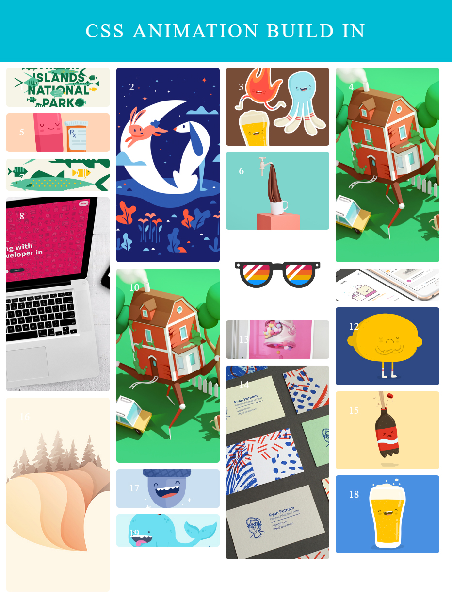
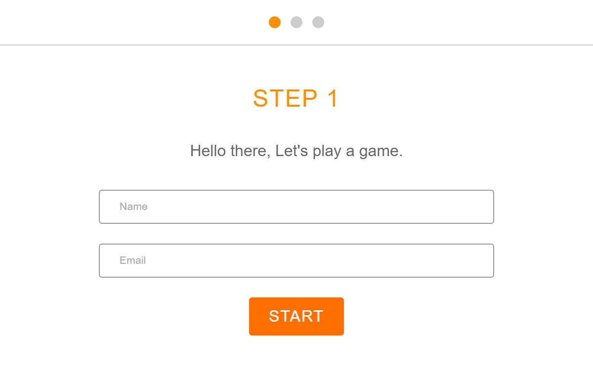
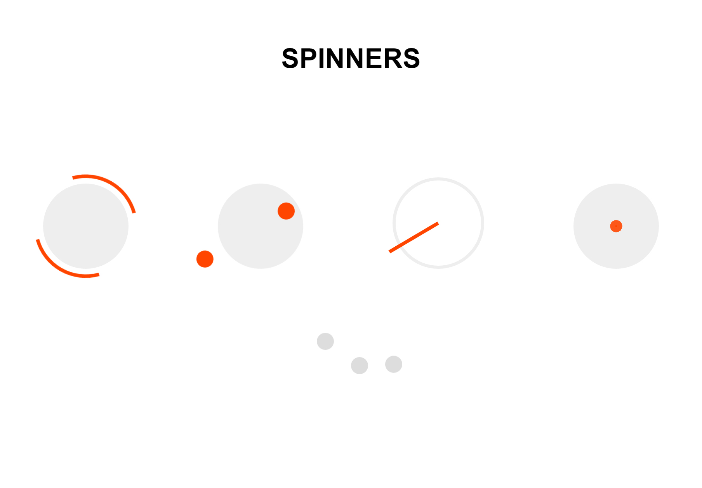
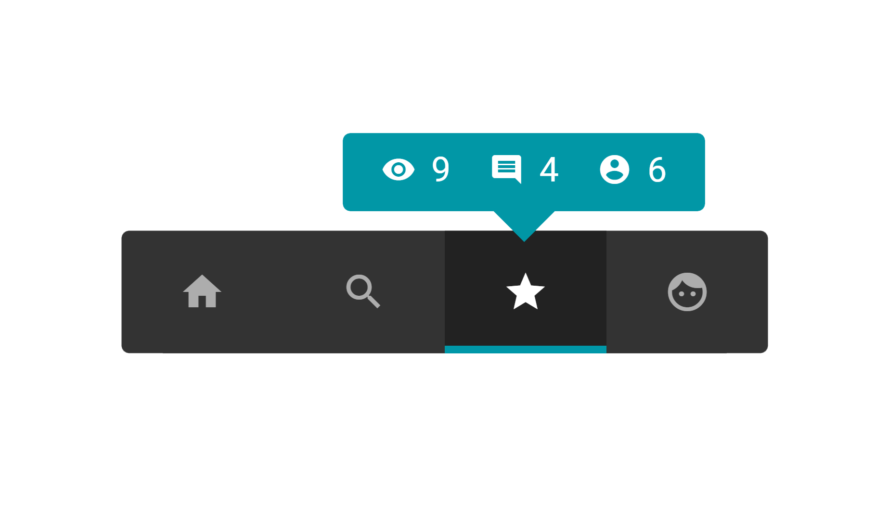
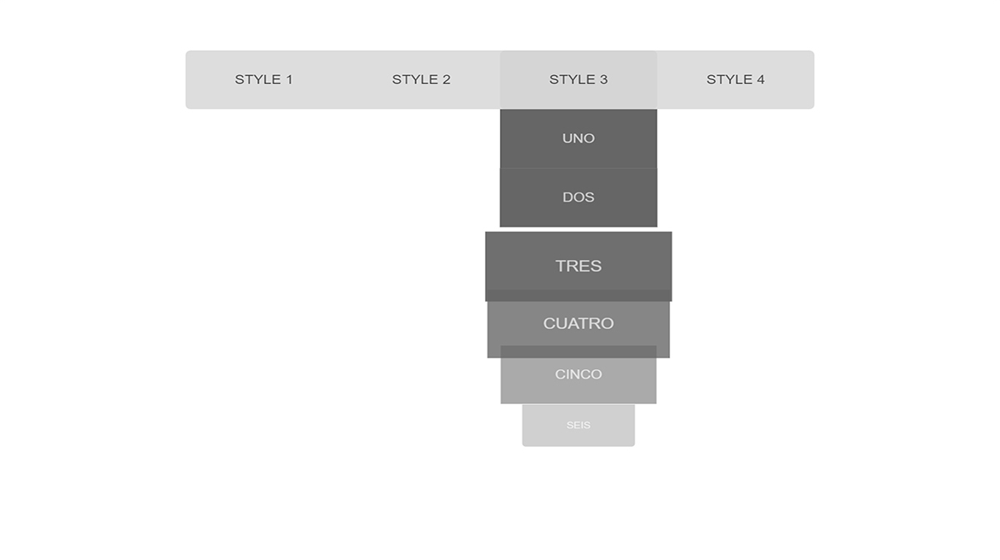

Here we animate each element onto the page in order and with style!

To view the page on CodePen <a href="https://codepen.io/KSMaan/pen/wzgXPx" target="_blank">click here</a>

Use animations to help users pace themselves through this web form.

To view the page on CodePen <a href="https://codepen.io/KSMaan/pen/vXgAmk" target="_blank">click here</a>

Loading Screen spinners.

To view the page on CodePen <a href="https://codepen.io/KSMaan/pen/PGyrOB" target="_blank">click here</a>

Some different ideas for animating alerts and notifications.

To view the page on CodePen <a href="https://codepen.io/KSMaan/pen/xEyvwk" target="_blank">click here</a>

A few different ways to animate a css drop down menu.

To view the page on CodePen <a href="https://codepen.io/KSMaan/pen/gwWVBO" target="_blank">click here</a>

